<h1 align="center"> WIP WIP WIP WIP</h1>

<h1 align="center"> MATASUEGRAS TATTOO ESTUDIO</h1>
​
​

Proyecto 5 - Web estudio de tatuajes- Semana 9-10

​

Proyecto de creacion de la web tanto en fronted y backend por Pascual Fernandez.
 
Desarrollada como formacion del Bootcamp de Full Stack Developer de Geekshubs Academy.

​
​

​
​
<h5 align="center"> Tecnologías utilizadas</h1>
​

JavaScript, HTML5, CSS3, Bootstrap, GIT y GitHUB

  <tr >
    <td valign="top"></td>
    <td valign="top"></td>
    <td valign="top"></td>
    <td></td>
     <td valign="top"></td>
      <td valign="top"></td>
      <td valign="top"></td>
      <td valign="top"></td>
      <td valign="top"></td>
      <td valign="top"></td>
  
  
  

​
<a href = "https://vimeo.com/885968667?share=copy">HAZ CLICK PARA VER EL VIDEO DE LA WEB EN FUNCIONAMIENTO</a>

                   
​
## Tabla de contenidos
​

- [👩🏻‍💻 Descripción del proyecto]
- [🔍 Observaciones]
- [⚖️ Licencia y Copyright]
- [📚Instrucciones]
​
​
### Descripción
​
Quinto proyecto creado durante la semana 9 y 10 del bootcamp, consiste en una web completamente funcional de un estudio de tatuajes. Tanto a nivel de frontend como de backend.

Consta de las siguientes funcionalidades.

Registro de usuarios.

Login y LogOut de usuarios.

Creacion - Anulacion y modificacion de citas.

Panel de usuario, de tatuador y de admin.

Galeria de Tattoos.

Galeria de Artistas.

Diferentes vistas de informacion del estudio.

Consulta a BBDD

API de googlemaps.

API de instagram.

Conexion a Redes sociales.

## Aqui las diferentes vistas del juego:

###### Menu principal:
Vista principal del estudio
Aqui puedes ver toda la pagina en general, con sus diferentes secciones 

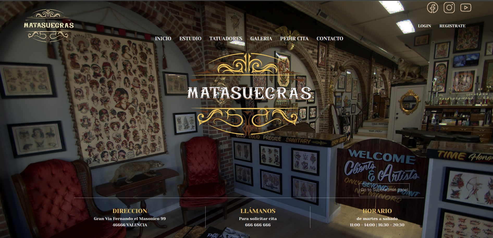
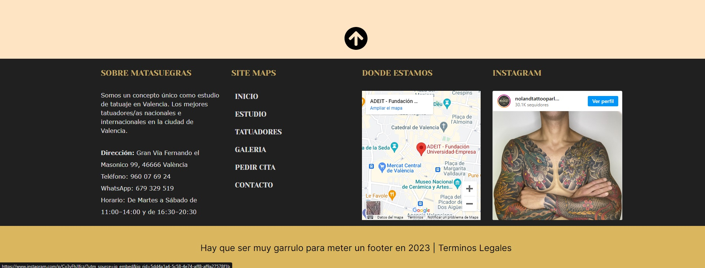

###### El Estudio
Vista del estudio

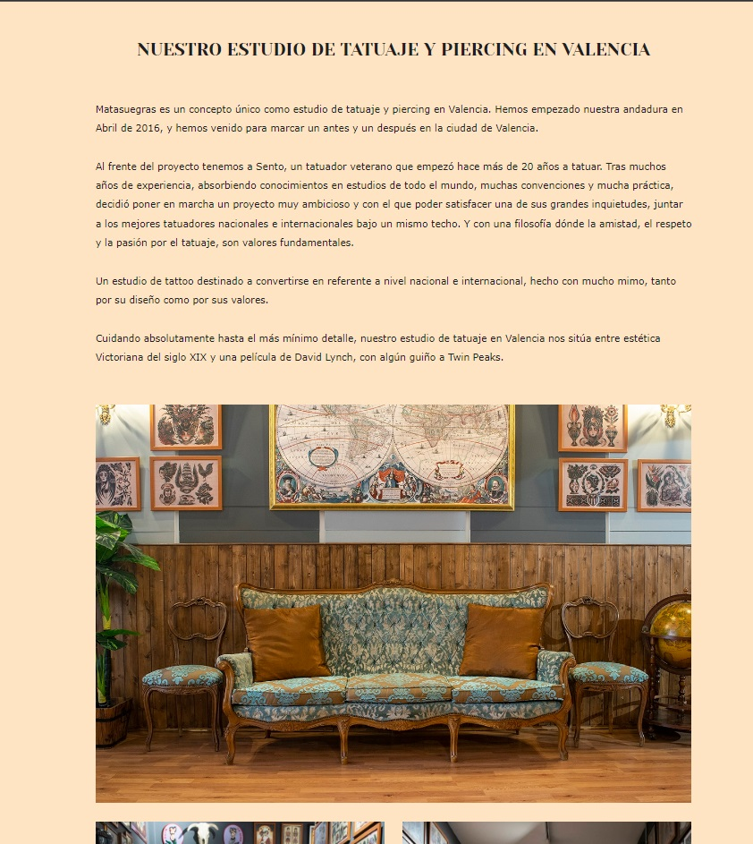
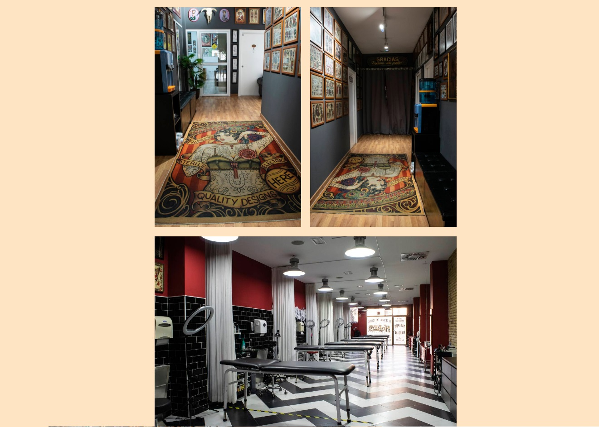

###### Tatuadores
Vista de los tatuadores, con una breve descripcion, un bonito hover y si haces click en ellos se abre su presentacion.

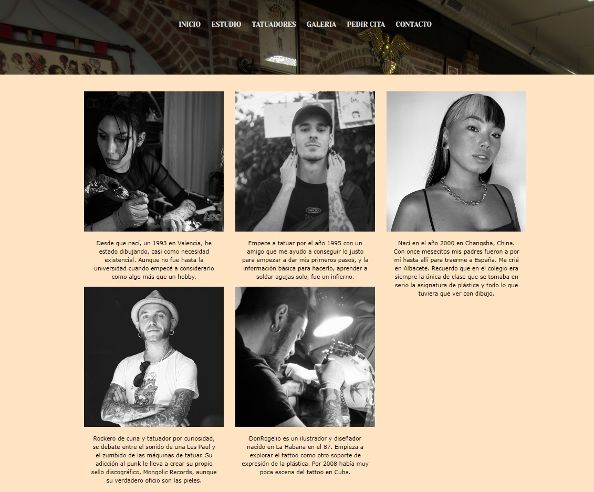
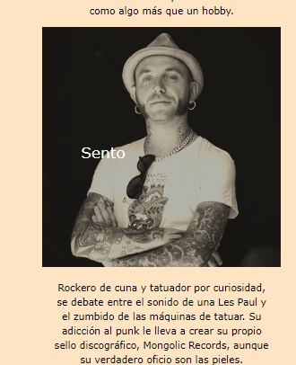
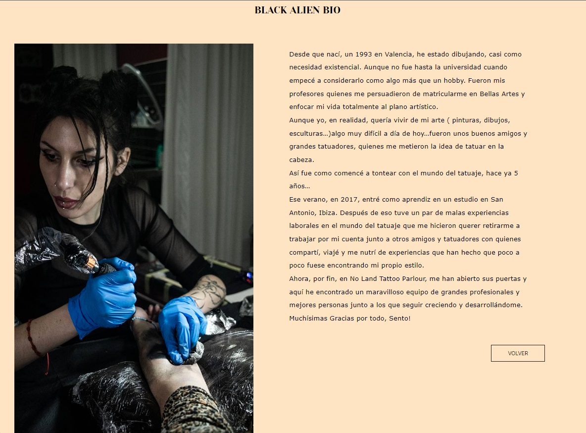

###### Galeria
Galeria de tattoos

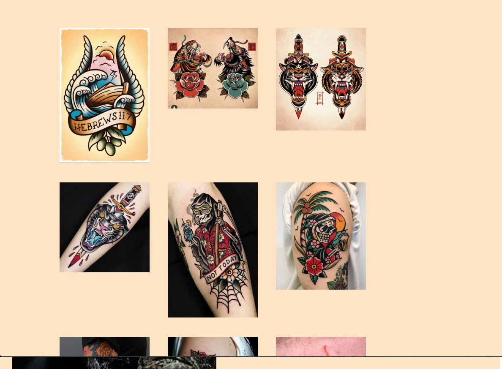

###### Contacto
Formulario de contacto, que envia un mail con los datos para consultar cualquier duda
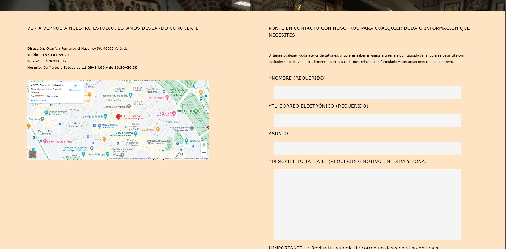

###### Citas
Vista del crador de citas, una vezte logeas puedes reservar una cita en el estudio

###### Login
Vista del Login

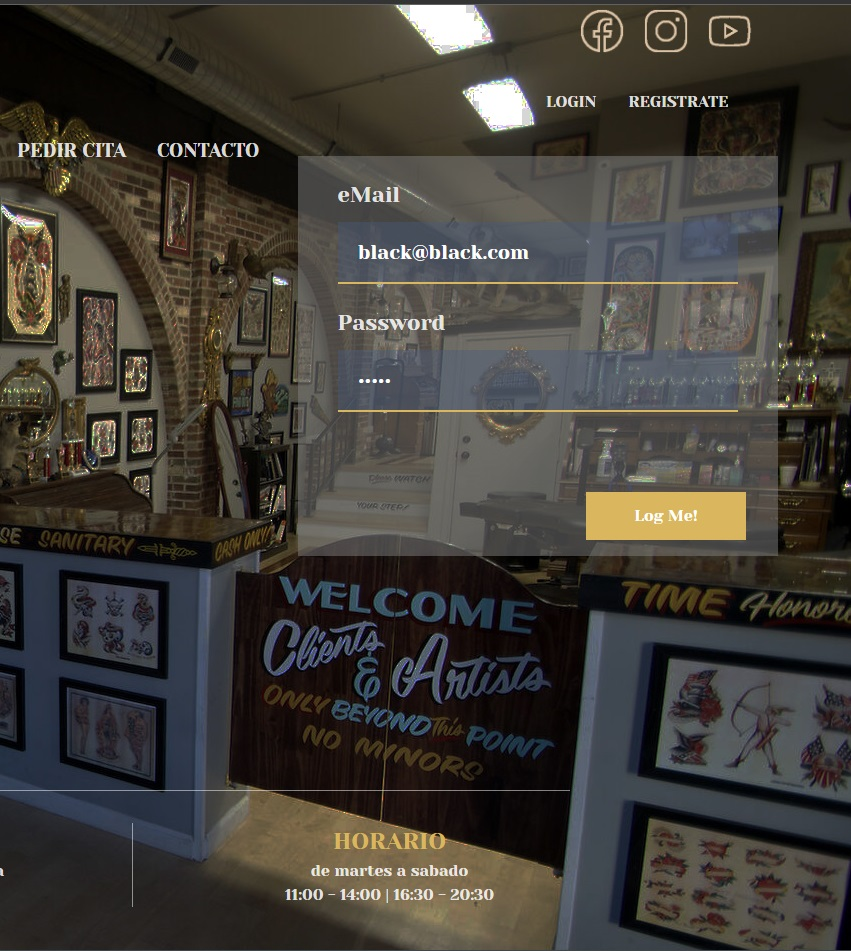

###### Register
Vista del Register

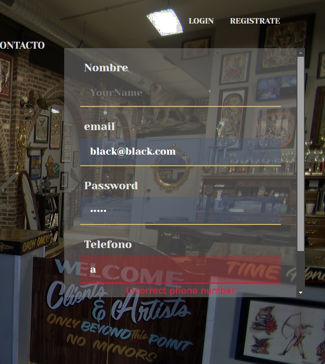

###### Panel de usuario/tatudaor
Vista del panel de usuario

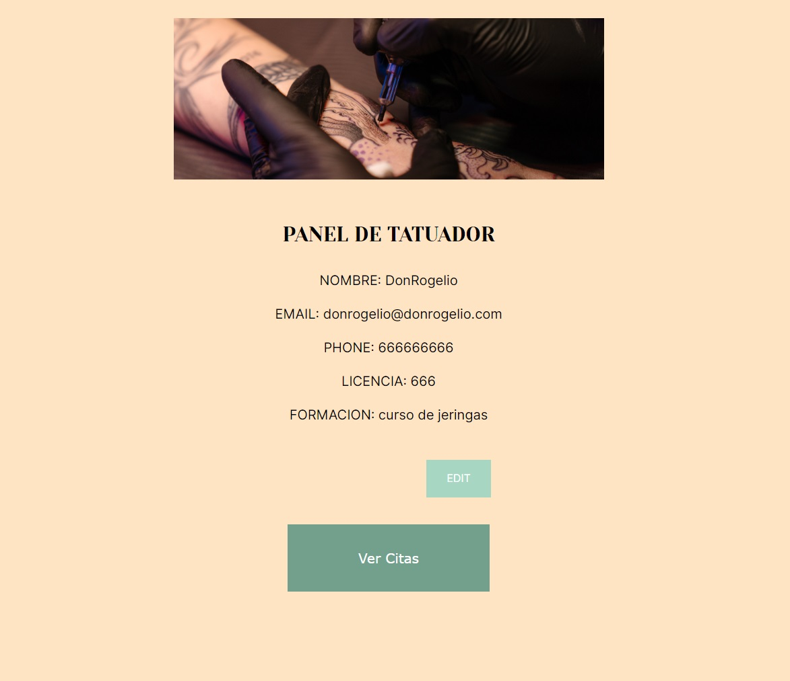
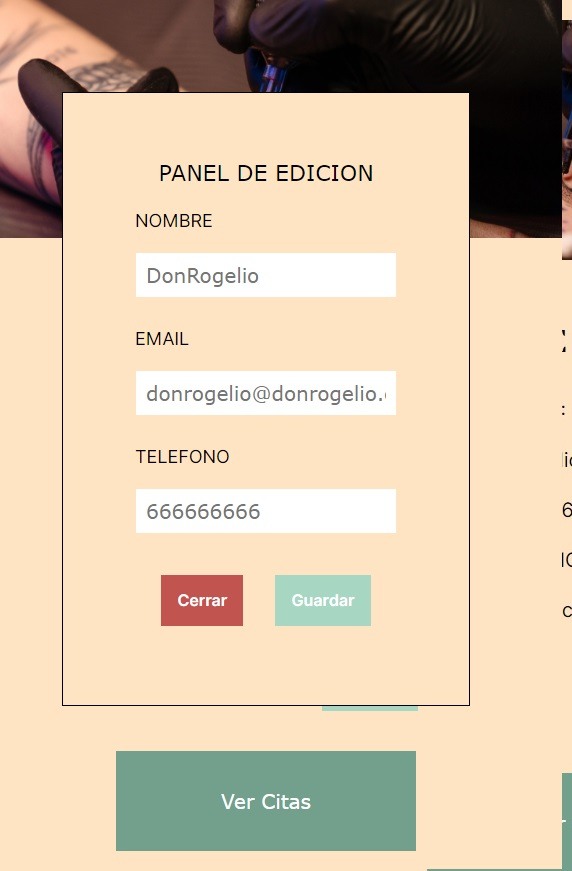

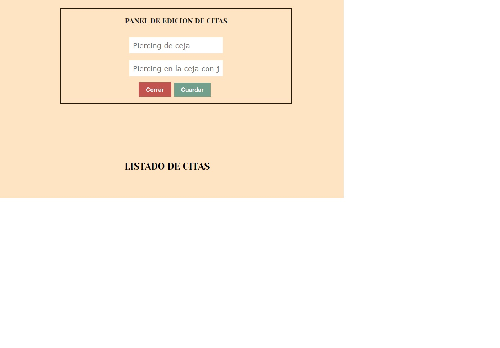

###### Panel de admin
Vista del panel de admin

### Observaciones
​
- ��Todo el codigo ha sido creado en em's.
- ��Boton back to top en la vista main
- ��Necesito mas tiempo para asimilar muchos trozos de codigo bien.
- ��Ahora mismo el backend no esta todo lo seguro que deberia, tengo que activar algunos middlewares

 

### Cambios pendientes
- ��Todos los alerts han de ser modales en la version definitiva.
- ��Añadir busqueda
- ��Mejorar el responsive
- ��Mejorar la edicion de campos con mas opciones

###Explicacion de todo la logica del codigo

######NAVBAR LOGIN
->Si estas logeado el array de botones es LOGOUT, si no el array de botones es LOG IN y REGISTER

-->Cuando renderiza:
SI el nombre dol boton coincide con LOGOUT, aplica el estilo condicional correspondiente a la classname "logout" si no aplica "".

Como valor a los botones le da el valor del nombre que esta en el objeto y el navigate correspondiente.

Por ultimo tiene un renderizaco condicional que se cumple si estas logeado, entonces ademas de LOGOUT renderiza un dic con el nombre que ha obtenido del token

######LOGIN y REGISTER

La logica tal cual vista en clase

######SUPERADMIN PANEL BUTTON

->Comprueba si estas logeado,y recupera del token el nivel del usuario.
Segun el nivel de usuario almacena en una variable una DESTINATION y un NOMBRE

-->Cuando renderiza:
Primero comprueba que se tenga que renderizar creando una constante que luega comprobara en el rendirzado condicional. Si esta constante se cumple, renderiza un boton el el nombre y la destination correspondiente al nivel de usuario, y si no se cumple, pues renderiza null.

######MAIN USER PANEL

->Comprueba que estas logeado, ademas si no estas logeado no te deja entrar aunque hardcodees el url en el navbar
Luego crea una destination para el boton

-->Cuando renderiza:
Crea un panel sencillo, con la info que se ha traido del token y un boton con la destination que hemos guardado arriba 
Luego tiene una funcion que te hace navigate a esa destination.

######TATTOO Y SUPERADMIN

TattoPanel y superAdminPanel, son practicamente iguales, solo que superAdmin tiene dos destinations, entonces renderiza dos botones, uno va a citas y otro a todos los usuarios.

######APPOINTMENT

->Si no estas logeado , te dirige a /login, ya que no puedes pedir una cita sin estar en la aplicacion.

El primer useEffect va a fetchear todos los tatuadores para luego poder mapearlos.

handleDataChange, aparte del tipico uso de una funcion handler para setear el valor segun el valor que tenga el input, tiene un control de fechas para no poder pickear los fines de semana (STACK OVERFLOW)

handleTattooArtist, tipica funcion handler para almacenar el tatuador del input, pero que ademas una vez lo tiene, como tambien necesitamos la id ya que el backend la pide, lo que hace es mapear todo el array de tatuadores.

Si existe ese tatuador, con un setter guarda tambien la id de ese tatuador.

El resto de funciones handler son al uso, simplemente cogen el evento y lo almacenan.

handleSummit: funcion del boton del formulario, primero empaqueta toda la info que necesita en un objeto que sera el que mande como body cuando haga la APICALL

Luego tiene una comprobacion para ver que no hayas dejado ningun campo vacio y poder generar la cita correctamente.

y por ultimo getTodayDate

Funcion de STACK OVERFLOW que obtiene la fecha de hoy (que mas adelante pasaremos como parametro al daypicker para bloquear citas de dias atrasados)

--> Cuando renderiza:

Genera una seria de inputs normales cada uno con su handler para manejar el evento, como peculiaridad, el siguiente parametro en el day picker --min={getTodayDate()}--que bloquea las fechas anteriores al dia de hoy y el mapeo que hace al array de usuarios para generar las diferentes opciones en el select de tatuadores.

Por ultimo renderiza el boton enviar con la funcion handleSummit que manda toda la info al backend.

  
### Agradecimientos

A toda esos heroes anonimos que suben trocitos de codigo a internet y hace la vida mucho mas facil a los estudintes.
​
​
### Licencia y copyright
📝 La licencia utilizada es una MIT License.
Este proyecto ha sido realizado pixel a pixel por mi, Pascual Fernandez, para completar la segunda semana del BootCamp Full Stack de GeeksHubs Academy Valencia.