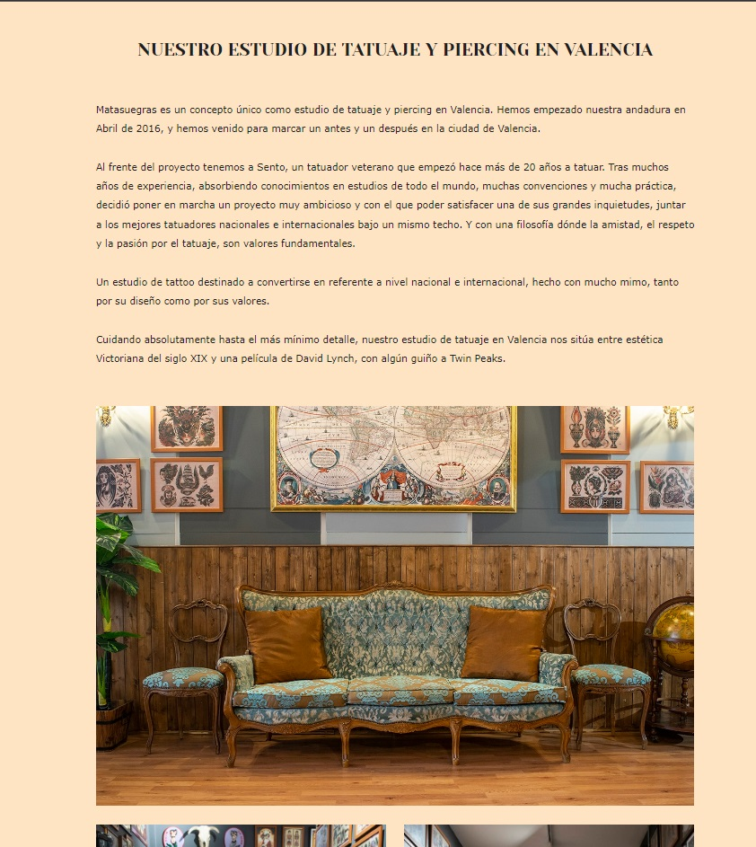
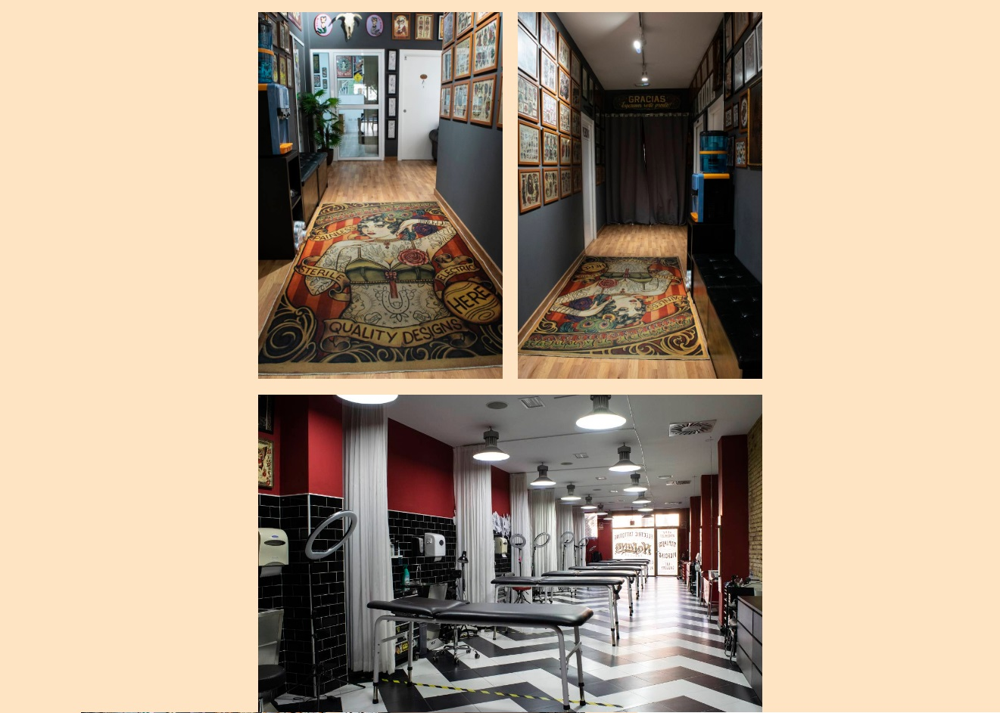

<h1 align="center"> WIP WIP WIP WIP</h1>

<h1 align="center"> MATASUEGRAS TATTOO ESTUDIO</h1>
​
​

Proyecto 5 - Web estudio de tatuajes- Semana 9-10

​

Proyecto de creacion de la web tanto en fronted y backend por Pascual Fernandez.
 
Desarrollada como formacion del Bootcamp de Full Stack Developer de Geekshubs Academy.

​
​

​
​
<h5 align="center"> Tecnologías utilizadas</h1>
​

JavaScript, HTML5, CSS3, Bootstrap, GIT y GitHUB

  <tr >
    <td valign="top"></td>
    <td valign="top"></td>
    <td valign="top"></td>
    <td></td>
     <td valign="top"></td>
      <td valign="top"></td>
      <td valign="top"></td>
      <td valign="top"></td>
      <td valign="top"></td>
  
  

​
<a href = "https://pascufcalvo.github.io/FSDVlcWeek3-4/index.html">CLICK TO PLAY</a>

                   
​
## Tabla de contenidos
​

- [👩🏻‍💻 Descripción del proyecto]
- [🔍 Observaciones]
- [⚖️ Licencia y Copyright]
- [📚Instrucciones]
​
​
### Descripción
​
Quinto proyecto creado durante la semana 9 y 10 del bootcamp, consiste en una web completamente funcional de un estudio de tatuajes. Tanto a nivel de frontend como de backend.

Consta de las siguientes funcionalidades.

Registro de usuarios.

Login y LogOut de usuarios.

Creacion - Anulacion y modificacion de citas.

Panel de usuario, de tatuador y de admin.

Galeria de Tattoos.

Galeria de Artistas.

Diferentes vistas de informacion del estudio.

Consulta a BBDD

API de googlemaps.

API de instagram.

Conexion a Redes sociales.

## Aqui las diferentes vistas del juego:

###### Menu principal:
Vista principal del estudio
Tiene scroll hacia abajo para ir viendo todas las secciones

###### El Estudio
Vista del estudio

###### Tatuadores
Vista de los tatuadores

###### Galeria
Galeria de tattoos

###### Contacto
Formulario de contacto

###### Citas
Vista del crador de citas

###### Login
Vista del Login

###### Register
Vista del Register

###### LogOut
Vista del logout

###### Panel de usuario
Vista del panel de usuario

###### Panel de tatuador
Vista del panel de tatuador

###### Panel de admin
Vista del panel de admin

### Observaciones
​
- ��Todo el codigo ha sido creado en em's.
- ��Me gustaria añadir mas hooks para estilos.
- ��Boton back to top en la vista main
- ��Necesito mas tiempo para asimilar muchos trozos de codigo bien.

 
 

### Cambios pendientes
- ��Me gustaria hacer el tablero dinamico mediante drag & drop.
- ��Mejorar el responsive

### Agradecimientos

A toda esos heroes anonimos que suben trocitos de codigo a internet y hace la vida mucho mas facil a los estudintes.
​
​
### Licencia y copyright
📝 La licencia utilizada es una MIT License.
Este proyecto ha sido realizado pixel a pixel por mi, Pascual Fernandez, para completar la segunda semana del BootCamp Full Stack de GeeksHubs Academy Valencia.